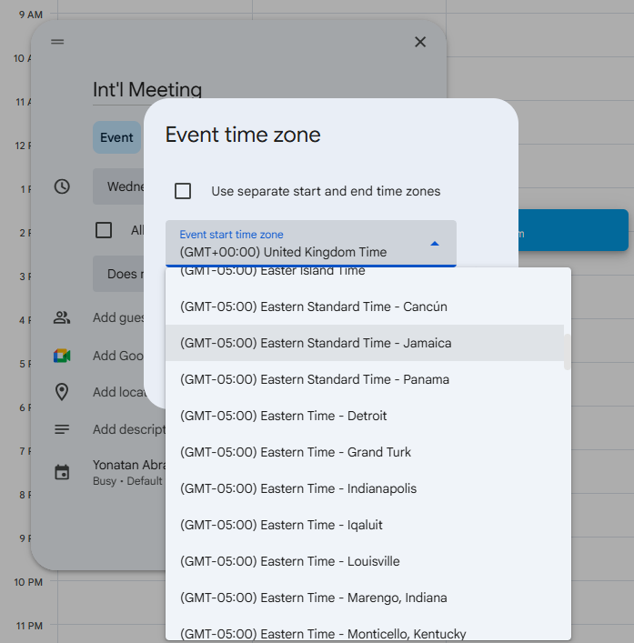
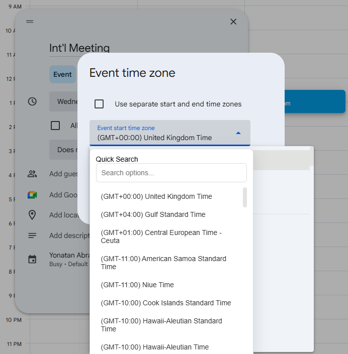

  

# Dropdown Searcher

A lightweight Chrome Extension that enhances web accessibility and UX by injecting a searchable interface into both native and custom dropdown menus.

## UX Comparison

| Without Plugin | With Plugin |
| :---: | :---: |
|  |  |
| *Standard, non-searchable dropdown* | *Enhanced searchable interface* |

## 🚀 Overview
Navigating large dropdowns (time zones, countries, or long lists) is a notorious friction point in web UX. This extension detects when a user interacts with a dropdown and provides an instant, filtered search overlay. Once an item is selected, the extension proxies the interaction back to the original element.

## 🛠️ Key Technical Features
* **Hybrid Detection:** Supports standard HTML `<select>` tags and complex ARIA-compliant `[role="combobox"]` elements (found in Google Calendar, Jira, etc.).
* **Intelligent Positioning:** Uses `getBoundingClientRect()` combined with window scroll offsets to dynamically anchor the search popup next to the trigger element.
* **Data Scrapping & Syncing:**
    * Extracts labels and values from standard `HTMLOptionsCollection`.
    * Traverses DOM trees to find associated `[role="option"]` items in custom JS-heavy menus.
* **State Management & Dispatching:** Manually dispatches `change` and `input` events to ensure that modern frameworks (React, Vue, Angular) register the selection and update their internal state.
* **Z-Index Management:** Implements a high-stacking context (`2147483647`) to ensure the UI remains visible above modals, sidebars, and sticky headers.

## Project Structure, for those who are new to building plugins
* `manifest.json`: Defines the extension's scope using the V3 Manifest API.
* `content.script.js`: The primary engine for DOM monitoring and event handling.
* `styles.css`: Scoped styling to ensure a clean, modern UI that doesn't conflict with host site CSS.

## Installation in Extensions Dev Mode
1. Clone this repository.
2. Navigate to `chrome://extensions`.
3. Toggle **Developer mode** to "On".
4. Click **Load unpacked** and select the project directory.

_Note: This will hopefully be available in the Plugins store soon, pending review from Google._
